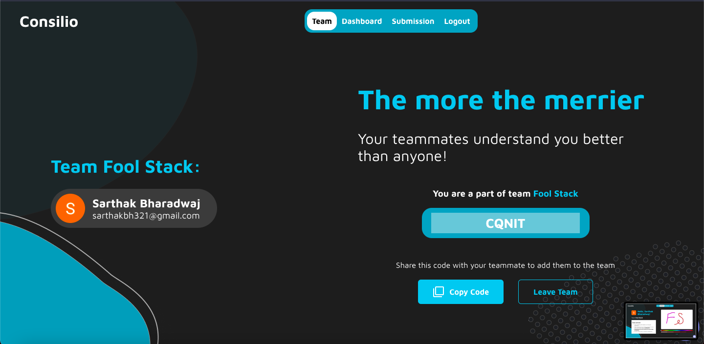
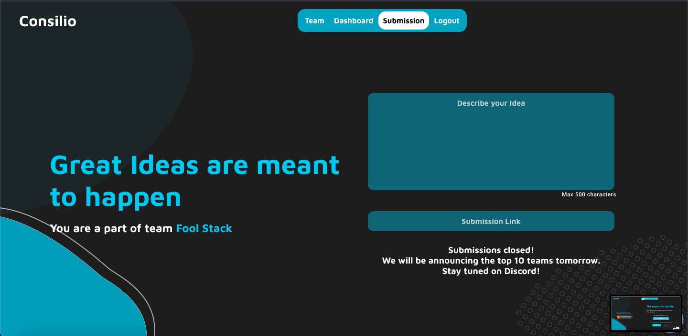

<p align="center"><a href="https://www.codechefvit.com" target="_blank"></a>
</p>

# Consilio Frontend

> Frontend for CodeChefVIT's Design Hackathon Consilio

---

[](https://designwith.codechefvit.com/)

## Features

- Reduce redundancy.
- Well updated and informative.
- Easy to use.

## Important Links

- [Consilio Backend Repo](https://github.com/CodeChefVIT/Consilio-Backend)
- [Consilio Portal](https://designwith.codechefvit.com)

## Screenshots

<br />





## Instructions to run

```
$ git clone https://github.com/CodeChefVIT/Consilio-Frontend
$ cd Consilio-Frontend
>> Refer .env.example for environment variables
$ npm install
$ npm start
```

## Contributors

<table>
  <tr>
    <td align="center"><a href="https://github.com/Sarthakbh321"><br /><sub><b>Sarthak Bharadwaj</b></sub></a><br /> </td>
      <td align="center"><a href="https://github.com/vinayakguptaa"><br /><sub><b>Vinayak Gupta</b></sub></a><br /> </td></td>
   
   
  </tr>
  </table>

## License

[](https://opensource.org/licenses/MIT)

<p align="center">
	With :heart: by <a href="https://www.codechefvit.com" target="_blank">CodeChef-VIT</a>
</p>
